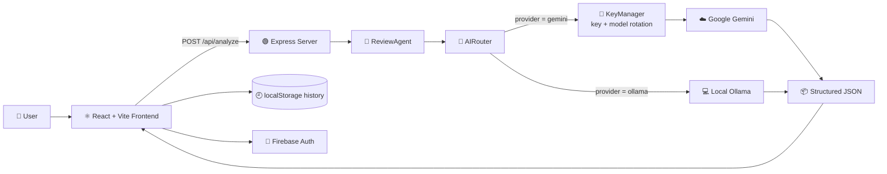

# CodeLensAI

**AI-powered code review and refactoring platform with a fault-tolerant, multi-provider inference backend**


---

## 📌 Overview

**CodeLensAI** analyzes source code and returns a structured review: an overall health score, readability and complexity ratings, a list of line-level issues with severity and fix suggestions, and a refactored version of the code that can be applied to the editor in one click.

Analysis can run on **Google Gemini** (cloud) or a **local Ollama model**, selectable per request. The backend hides the differences between the two providers behind a single router, so the frontend always receives the same JSON structure.

---

## ✨ Features

- 🔍 **Code analysis** — health score (0–100), readability and complexity metrics, and a list of issues with line number, severity (`high` / `medium` / `low`), explanation and suggested fix
- 🛠️ **One-click refactor** — view the refactored code and apply it straight into the editor
- 🎯 **Custom intent** — tell the reviewer what to focus on (default: reduce time complexity and optimize performance)
- 🔀 **Dual providers** — switch between **Cloud (Gemini)** and **Local (Ollama)** from the UI
- ♻️ **Resilient Gemini routing** — automatic API-key rotation and model fallback on rate limits and outages
- 🧱 **Schema-enforced output** — Gemini's `responseSchema` and Ollama's `format: 'json'` return the same strict structure
- 🌐 **Multi-language editor** — Monaco editor with Python, C, C++ and Java
- 🕘 **Analysis history** — the last 50 analyses are saved in the browser, and entries can be renamed, expanded or deleted
- 🔐 **Authentication** — Firebase email/password and Google sign-in, with protected routes
- 🔔 **In-app notifications** and a responsive, dark-themed UI (Framer Motion, particle background)

---

## 🏗️ Architecture



### How the backend stays reliable

| Layer | Responsibility |
|---|---|
| `server.ts` | Express API (`POST /api/analyze`), CORS, input validation, maps rate-limit errors to HTTP 429 |
| `agents/reviewAgent.ts` | Builds the review prompt from the code, language and user intent, and returns the parsed result |
| `services/aiRouter.ts` | Provider abstraction: routes to Gemini or Ollama, enforces JSON schemas, strips stray code fences, and parses the response |
| `services/KeyManager.ts` | Tries each Gemini API key in turn; when all keys are exhausted on a model, it falls back to the next model in the chain |

**Gemini fallback chain:** `gemini-2.5-flash` → `gemini-2.0-flash` → `gemini-2.0-flash-lite` → `gemma-3-27b-it`, with up to 15 retries across keys and models on `429`, `503`, `404` and `400` errors.

---

## 🧰 Tech Stack

<p>
  
</p>

| Area | Tools |
|---|---|
| Frontend | React 19, TypeScript, Vite, React Router, Tailwind CSS, Framer Motion, Monaco Editor, Lucide icons |
| Backend | Node.js, Express 5, TypeScript, `ts-node`, `nodemon` |
| AI | Google Gemini (`@google/generative-ai`), Ollama (`ollama`), default local model `qwen2.5-coder:7b` |
| Auth | Firebase Authentication |
| Deployment | Vercel (frontend + backend as separate services) |

---

## 📁 Project Structure

```text
CodeLens-AI/
├── backend/
│   ├── src/
│   │   ├── server.ts               # Express app and /api/analyze route
│   │   ├── agents/
│   │   │   └── reviewAgent.ts      # Prompt construction and orchestration
│   │   └── services/
│   │       ├── aiRouter.ts         # Gemini / Ollama routing and JSON schemas
│   │       └── KeyManager.ts       # API-key and model rotation
│   ├── package.json
│   └── tsconfig.json
├── frontend/
│   ├── src/
│   │   ├── pages/                  # Home, Login, Analyzer, History, Settings
│   │   ├── components/             # CodeEditor, ScoreCard, IssueList, RefactorView, Footer, ui/*
│   │   ├── hooks/useAnalyzer.ts    # Analysis state, history saving, apply-refactor
│   │   ├── contexts/               # AuthContext, NotificationContext
│   │   └── services/               # api.ts (backend client), firebase.ts
│   ├── .env.example
│   └── package.json
└── vercel.json                     # Frontend + backend service routing
```

---

## 🚀 Getting Started

### Prerequisites

- Node.js 18+ and npm
- A **Google Gemini API key** (for the cloud provider)
- **Ollama** installed with a code model pulled (for the local provider), for example `ollama pull qwen2.5-coder:7b`
- A **Firebase** project (optional — if it isn't configured, the app runs without authentication)

### 1. Clone

```bash
git clone https://github.com/HarshKhetan20/CodeLens-AI.git
cd CodeLens-AI
```

### 2. Backend

```bash
cd backend
npm install
```

Create `backend/.env`:

```env
# One or more Gemini keys, comma-separated (rotated automatically on rate limits)
GEMINI_API_KEYS=key_one,key_two,key_three

# Local Ollama settings
OLLAMA_BASE_URL=http://127.0.0.1:11434
OLLAMA_DEFAULT_MODEL=qwen2.5-coder:7b

# Optional, defaults to 3001
PORT=3001
```

Start the server:

```bash
npm run dev
```

### 3. Frontend

```bash
cd ../frontend
npm install
cp .env.example .env
```

Fill in `frontend/.env` with your Firebase values (see `.env.example`), then run:

```bash
npm run dev
```

Open the URL Vite prints. In development the frontend calls the backend at `http://<host>:3001`.

### 4. Use it

1. Sign in (or continue without auth if Firebase isn't configured).
2. Open **Analyzer**, paste code, pick the language and the provider.
3. Optionally describe your **intent**, then click **Analyze Code**.
4. Review the score, issues and refactored code, then click **Apply Refactor**.

---

## 🔌 API

### `POST /api/analyze`

**Request body**

```json
{
  "code": "def f(x): ...",
  "language": "python",
  "provider": "gemini",
  "intent": "Reduce time complexity"
}
```

| Field | Required | Notes |
|---|---|---|
| `code` | ✅ | Source code to analyze |
| `language` | – | Defaults to `python` |
| `provider` | – | `gemini` (default) or `ollama` |
| `intent` | – | Review focus; defaults to performance optimization |

**Response**

```json
{
  "score": 72,
  "detectedLanguage": "python",
  "metrics": {
    "readability": "Moderate",
    "readabilityDesc": "…",
    "complexity": "Low",
    "complexityDesc": "…"
  },
  "issues": [
    { "type": "…", "line": 4, "severity": "medium", "message": "…", "suggestion": "…" }
  ],
  "refactored_code": "…"
}
```

Errors return `{ "error": "…" }` with status `400` (missing code), `429` (rate limited) or `500`.

---

## ☁️ Deployment

`vercel.json` defines two services: the Vite frontend served at `/` and the Express backend served under `/_/backend`. In production, the frontend automatically calls `/_/backend/api/analyze`. Set `GEMINI_API_KEYS` and the `VITE_FIREBASE_*` variables in the Vercel project settings.

> The Ollama provider needs a reachable Ollama daemon, so it is intended for local use. Use Gemini in a hosted deployment.

---

## 🧭 Implementation Notes

- Analysis runs in a **single request per review**, which keeps free-tier Gemini quota usage to one request per analysis. The router also defines schemas for a multi-phase flow (context extraction and QA pass), but the current agent doesn't use them.
- History and the theme and language settings in the UI are **client-side only** (browser `localStorage` or local state). They aren't synced across devices.
- The landing page includes marketing sections such as pricing and a changelog; billing isn't implemented.

---

## 🛣️ Roadmap

- [ ] Persist history per user in Firebase
- [ ] Add more languages beyond Python, C, C++ and Java
- [ ] Add a diff view between original and refactored code
- [ ] Add automated tests and CI
- [ ] Add rate limiting and authentication on the backend API

---

## 👤 Author

**Harsh Khetan** — CSE (AI & ML), SRM Institute of Science & Technology

[LinkedIn](https://www.linkedin.com/in/harshkhetan20/) · [GitHub](https://github.com/HarshKhetan20) · [harshkhetan20@gmail.com](mailto:harshkhetan20@gmail.com)
